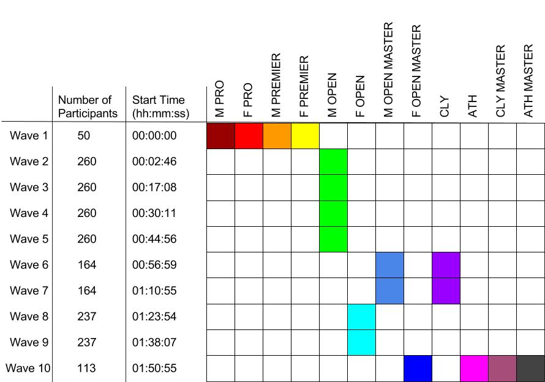

# 2016 HiMCM

[HiMCM](https://www.comap.com/highschool/contests/himcm/index.html) is a high school
mathematical modeling competition sponsored by [COMAP](https://www.comap.com/)
(Consortium for Mathematics and its Applications). The contest challenges high
school students to analyze a real world problem through a mathematical lens.

## Global Finalist Solution

This repository contains a solution for Problem A of that year and was awarded
the distinction of finalist (top \~7%). The project developed both an analytical
model as well as a computational model. The below diagram represents the proposed
triathalon schedule from the above models.

  

This work was a collaboration between students at the North Carolina School of
Science and Math. The members of the team were Adithya Balaji, Mukil Guruparan,
Skanda Sastry, and D Conner Borkowski. Below are some relevant links.

* [Problem Description](https://github.com/adithyabsk/himcm/blob/main/2016_HiMCM_Problems.pdf)
* [This Finalist Paper](https://github.com/adithyabsk/himcm/blob/main/himcm.pdf)
* [COMAP Results](https://github.com/adithyabsk/himcm/blob/main/2016_Results.pdf)
